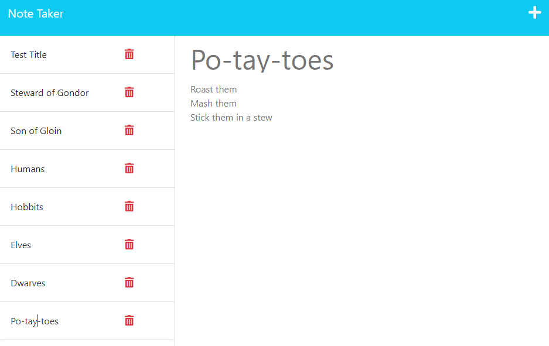

  # Note-Taker Application
  
  ## Description
  This application is intended to support organization and task management for the user. By storing notes in a digital database, the user can quickly refer to them to track their progress or mark items as complete. This project was developed as a requirement of the Berkeley Fullstack Flex Web Development coding bootcamp.
  
  ## Table of Contents
  
  * [Technologies_Used](#technologies-used)
  * [Installation](#installation)
  * [Preview](#preview)
  * [Usage](#usage)
  * [Credits](#credits)
  * [Tests](#tests)
  * [License](#license)
  * [Questions](#questions)
  
  ## Technologies Used
  - JavaScript
  - Node.js v18.12.1
    - File System
  - Express.js
  - UUID v4

  
  ## Installation
  N/A; you may access the application [here](https://github.com/sarah-jensen/note-taker)
  
  ## Preview
  

  
  ## Usage
  - On the Note-Taker Application landing page, click the "Get Started" button to create and manage your notes. 
  - Click the "+" button to create a new note; your note must contain a title and a body to be saved. 
  - Save your note by clicking the "save" icon.
  - Your saved notes will display on the left side of the page. Click the title of a note to view it.
  - Click the "delete" icon to delete a note.
  
  ## Credits
  Source code provided by UC Berkeley Fullstack Flex Web Development coding bootcamp.
  License badges created by [shields.io](https://shields.io/) 
  
  ## Tests
  N/A
  
  ## License
  This project is licensed under the MIT License - see Badge link for details.
  
  ## Questions
  If you have any questions or issues with the repo, please reach out to "[sarah-jensen]("https://github.com/sarah-jensen")" or create an issue in the "["repo"](https://github.com/sarah-jensen/note-taker)".
